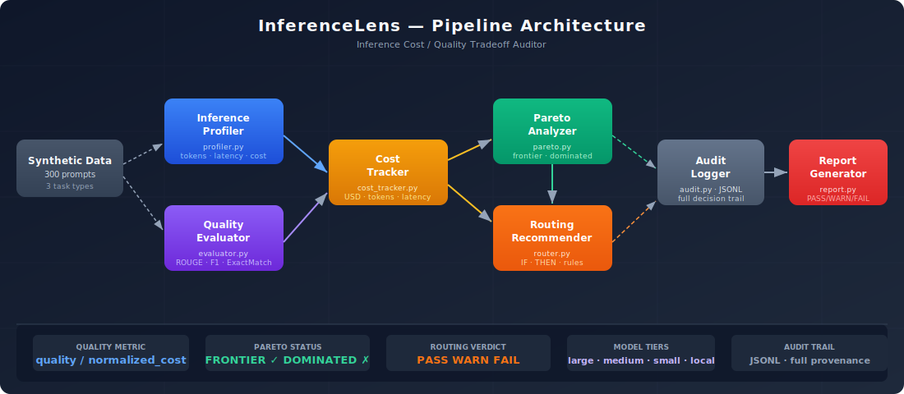
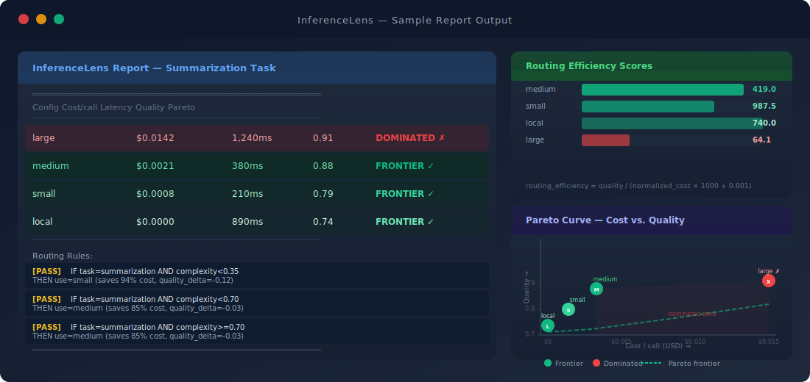

<div align="center">

# InferenceLens

**Inference Cost/Quality Tradeoff Auditor**

> An auditor for AI inference routing decisions — makes the cost/quality tradeoff explicit, measurable, and defensible.

[](https://www.python.org/)
[](https://fastapi.tiangolo.com/)
[](https://docs.pydantic.dev/)
[](tests/)
[](pipeline/pareto.py)
[](LICENSE)

</div>

---

## Architecture



## Sample Report Output



---

## The Problem

AI systems make implicit cost/quality tradeoffs on every inference call. Most teams don't know which model configuration is on their Pareto frontier, which is dominated, or whether their routing heuristics are costing more than they save.

The failure mode: **"AI systems that make implicit cost/quality routing decisions with no auditability."**

When `gpt-4o` handles a sentiment classification that `gpt-3.5-turbo` would solve at 94% quality for 97% less cost — that's a routing failure with no paper trail. InferenceLens finds it, proves it, and generates defensible routing rules backed by empirical evidence.

---

## The Thesis Question

> **How does an AI system know it's working correctly when cost and quality are competing constraints?**

InferenceLens answers this by profiling inference calls across model configurations, measuring quality degradation as cost decreases, finding the Pareto frontier, and generating routing recommendations with evidence.

---

## Component Architecture

| Component | File | Role |
|-----------|------|------|
| **InferenceProfiler** | `pipeline/profiler.py` | Runs tasks across model configs; logs tokens, latency, cost per call |
| **QualityEvaluator** | `pipeline/evaluator.py` | ROUGE-1 (summarization), macro F1 (classification), exact match (extraction); graceful fallback to semantic similarity |
| **CostTracker** | `pipeline/cost_tracker.py` | Logs token usage, USD cost, latency per call; aggregates by tier and task type |
| **ParetoAnalyzer** | `pipeline/pareto.py` | Identifies Pareto frontier; flags dominated configs (higher cost, lower quality than an alternative) |
| **RoutingRecommender** | `pipeline/router.py` | Generates IF/THEN routing rules per complexity band; outputs human-readable + structured rules |
| **AuditLogger** | `pipeline/audit.py` | Append-only JSONL audit trail of all inference decisions and routing choices |
| **ReportGenerator** | `pipeline/report.py` | Assembles InferenceLensReport: Pareto curve data, routing rules, PASS/WARN/FAIL verdict |

---

## Composite Scoring

```
routing_efficiency  =  quality_score  /  (normalized_cost × 1000  +  0.001)
pareto_rank         =  position on cost-quality frontier (1 = best)
audit_verdict       =  PASS   (optimal routing — frontier config)
                       WARN   (suboptimal — quality drop > 10% or savings < 20%)
                       FAIL   (dominated config in use)
```

**Pareto dominance rule:** Config A dominates Config B if:
```
A.avg_cost < B.avg_cost  AND  A.avg_quality >= B.avg_quality
```

---

## Sample Output

```
InferenceLens Report — Summarization Task
═══════════════════════════════════════════════════════════════
Config           Cost/call   Latency    Quality    Pareto
───────────────────────────────────────────────────────────────
large            $0.0142     1,240ms     0.91      DOMINATED ✗
medium           $0.0021       380ms     0.88      FRONTIER  ✓
small            $0.0008       210ms     0.79      FRONTIER  ✓
local            $0.0000       890ms     0.74      FRONTIER  ✓
───────────────────────────────────────────────────────────────
[PASS] IF task=summarization AND complexity<0.35
       THEN use=small [gpt-3.5-turbo] (saves 94% cost, quality_delta=-0.12)

[PASS] IF task=summarization AND complexity<0.70
       THEN use=medium [gpt-4o-mini] (saves 85% cost, quality_delta=-0.03)

[PASS] IF task=summarization AND complexity>=0.70
       THEN use=medium [gpt-4o-mini] (saves 85% cost, quality_delta=-0.03)
═══════════════════════════════════════════════════════════════
Global verdict: PASS ✓
═══════════════════════════════════════════════════════════════
```

---

## Synthetic Dataset

`data/generator.py` generates a deterministic (seeded) dataset of **300 prompts** across 3 task types:

| Task Type | Count | Ground Truth | Quality Metric |
|-----------|-------|-------------|----------------|
| Summarization | 100 | Article summaries (5 domains) | ROUGE-1 F1 |
| Classification | 100 | Sentiment labels (positive/negative/neutral) | Macro F1 |
| Extraction | 100 | Structured JSON from documents | Field-level exact match |

**4 model configurations** are simulated (deterministic, seed=42):

| Tier | Model | Input cost/1K | Output cost/1K | Avg latency |
|------|-------|--------------|----------------|-------------|
| `large` | gpt-4o | $0.005 | $0.015 | 1,240ms |
| `medium` | gpt-4o-mini | $0.00015 | $0.0006 | 380ms |
| `small` | gpt-3.5-turbo | $0.0005 | $0.0015 | 210ms |
| `local` | ollama/mistral | $0.000 | $0.000 | 890ms |

---

## Quick Start

### 1. Install

```bash
git clone https://github.com/SidharthKriplani/inferencelens
cd inferencelens
python -m venv .venv && source .venv/bin/activate
pip install -r requirements.txt
cp .env.example .env
```

### 2. Run the demo

```bash
python demo.py
```

This runs the full pipeline: generates 300 synthetic prompts, profiles all 4 configs across all 3 task types (1,200 simulated calls), runs Pareto analysis, generates routing rules, writes the audit log, and prints the terminal report.

### 3. Run tests

```bash
pytest tests/ -v
```

### 4. Start the API

```bash
uvicorn api.main:app --reload
# → http://localhost:8000/docs
```

### 5. Docker

```bash
docker build -t inferencelens .
docker run -p 8000:8000 inferencelens
```

---

## API Reference

| Method | Endpoint | Description |
|--------|----------|-------------|
| `GET` | `/health` | Service health check |
| `GET` | `/configs` | Model configs and cost table |
| `POST` | `/profile` | Run profiling across model configs |
| `GET` | `/report/{task_type}` | Full report for summarization, classification, or extraction |
| `GET` | `/audit-log` | Query JSONL audit log with filters |

### POST /profile — request body

```json
{
  "task_types": ["summarization", "classification"],
  "n_samples": 20,
  "tiers": ["large", "medium", "small"]
}
```

### GET /audit-log — query params

```
?limit=50&event_type=routing_decision&task_type=classification&verdict=PASS
```

---

## Project Structure

```
inferencelens/
├── config.py                 # Model configs, cost table, routing thresholds
├── pipeline/
│   ├── profiler.py           # InferenceProfiler
│   ├── evaluator.py          # QualityEvaluator (ROUGE, F1, ExactMatch)
│   ├── cost_tracker.py       # CostTracker
│   ├── pareto.py             # ParetoAnalyzer
│   ├── router.py             # RoutingRecommender
│   ├── audit.py              # AuditLogger (JSONL)
│   └── report.py             # ReportGenerator
├── data/
│   └── generator.py          # Deterministic synthetic dataset
├── models/                   # Empty — no training required
├── api/
│   └── main.py               # FastAPI app
├── tests/
│   ├── test_generator.py
│   ├── test_evaluator.py
│   ├── test_pareto.py
│   ├── test_router.py
│   └── test_pipeline_integration.py
├── docs/assets/
│   ├── pipeline_architecture.svg
│   └── inference_report_sample.svg
├── demo.py
├── requirements.txt
├── .env.example
├── Dockerfile
└── README.md
```

---

## Design Decisions

**Why no ML model training?** The core problem is measurement and auditing, not prediction. InferenceLens is a metrological tool: it instruments inference calls, applies well-defined metrics (ROUGE, F1, exact match), and applies geometric analysis (Pareto dominance) to surface routing failures. No gradient descent required.

**Why deterministic synthetic data?** Real inference costs money and requires API keys. Seeded synthetic data (seed=42) allows the full pipeline to demonstrate meaningful cost/quality gradients without dependencies, making the project fully runnable in any environment.

**Why JSONL for the audit trail?** Append-only JSONL is the industry standard for audit logs: human-readable, streamable, queryable with jq, and trivially ingestible by any data platform.

**Why Pydantic v2 throughout?** All data structures are Pydantic models: type-safe, auto-validated, JSON-serializable. The FastAPI integration is zero-ceremony because request/response models are already Pydantic.

---

## Interview Defense

[📄 InferenceLens_Interview_Defense.pdf](docs/defense/InferenceLens_Interview_Defense.pdf) — covers:
- Pareto dominance definition and edge cases (non-monotone quality curves)
- Why ROUGE-1 for summarization and not BERTScore — tradeoffs and known limitations
- How routing rules translate to a production API gateway (beyond IF/THEN logic)
- Complexity signal definition — what features determine prompt complexity
- Scaling to thousands of task types and distribution shift in production

---

## Part of Applied LLM Systems Portfolio

This library is part of a 13-repo Applied LLM Systems portfolio targeting Applied LLM Systems Engineer, MLOps, and Technical AI PM roles.

**Applied Systems (LangGraph pipelines — same failure modes under domain pressure):**

| Project | Domain | Primary Failure Mode |
|---------|--------|----------------------|
| [LendFlow](https://github.com/SidharthKriplani/lendflow) | Financial underwriting | When to stop or escalate |
| [AgentReliabilityLab](https://github.com/SidharthKriplani/agentreliabilitylab) | Cyber threat triage | When to stop or escalate |
| [NexusSupply](https://github.com/SidharthKriplani/nexussupply) | Supplier risk intelligence | Conflicting signal fusion |

**Libraries & Auditors (domain-agnostic tooling):**

| Project | What It Audits |
|---------|---------------|
| **InferenceLens** | Inference cost/quality tradeoffs — Pareto frontier, routing rules |
| [RiskFrame](https://github.com/SidharthKriplani/riskframe_platform) | ML model lifecycle — champion/challenger, drift, fairness |
| [MetaSignal](https://github.com/SidharthKriplani/metasignal_platform) | A/B experiment validity — CUPED, guardrail-first, SRM |
| [DevPulse](https://github.com/SidharthKriplani/devpulse_platform) | Version-safe RAG — conflict detection, LLM-Last architecture |
| [PulseRank](https://github.com/SidharthKriplani/pulserank_platform) | Marketplace ranking — IPS debiasing, MMR diversity |
| [TrialCheck](https://github.com/SidharthKriplani/trialcheck_v0) | A/B readout audit — SRM, peeking, underpowered tests |
| [FeatureLeakageLens](https://github.com/SidharthKriplani/featureleakagelens_v0) | Pre-training leakage — target, temporal, overlap |
| [GoldenSetAuditor](https://github.com/SidharthKriplani/goldensetauditor_v0) | LLM/RAG eval dataset quality |
| [DocIngestQA](https://github.com/SidharthKriplani/docingestqa) | RAG document ingestion quality — 11 deterministic checks |
| [MetricLens](https://github.com/SidharthKriplani/metriclens) | Metric movement decomposition — mix shift vs rate shift |
